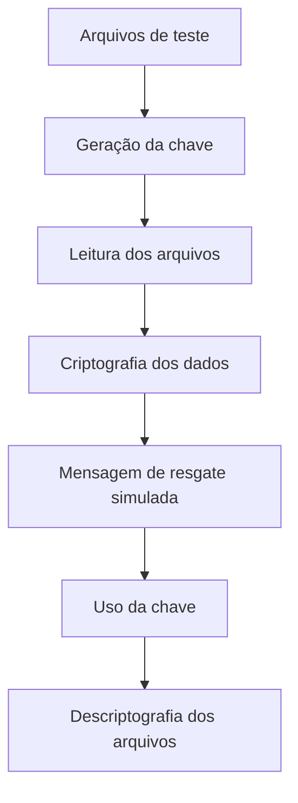

# Laboratório de Ransomware com Python

<p align="center">
  
  
  
  
</p>

<p align="center">
  Laboratório educacional de cibersegurança em Python para estudo de criptografia de arquivos, simulação de ransomware e processo de descriptografia em ambiente controlado.
</p>

---

## Sobre o Projeto

Este projeto apresenta um laboratório simples de **simulação de ransomware** utilizando **Python**.

O objetivo é estudar, em ambiente controlado, como funciona o processo de criptografia de arquivos, geração de chave, criação de mensagem de resgate e restauração dos arquivos por meio de descriptografia.

O laboratório foi criado apenas para fins educacionais, utilizando arquivos de teste dentro da pasta `test_files`.

---

## Ferramentas e Tecnologias Utilizadas

| Tecnologia | Finalidade |
|---|---|
| Python | Linguagem utilizada no laboratório |
| Cryptography | Biblioteca usada para criptografia e descriptografia |
| Fernet | Algoritmo utilizado para criptografar os arquivos |
| OS | Percorrer diretórios e localizar arquivos |
| Ambiente controlado | Execução segura apenas em arquivos de teste |

---

## Estrutura do Projeto

```text
laboratorio-ransomware-python/
│
├── ransoware.py
├── descriptografar.py
├── chave_key
│
├── test_files/
│   ├── dados_confidenciais
│   └── senhas.txt
│
└── README.md
```

---

## Arquivos do Projeto

### `ransoware.py`

Arquivo principal responsável pela simulação do ransomware.

Ele possui funções para:

- gerar uma chave de criptografia;
- carregar a chave criada;
- localizar arquivos dentro da pasta `test_files`;
- simular a criação de uma mensagem de resgate;
- executar o fluxo principal do laboratório.

---

### `descriptografar.py`

Arquivo responsável pelo processo de restauração dos arquivos.

Ele utiliza a chave gerada no laboratório para tentar descriptografar os arquivos presentes na pasta `test_files`.

---

### `chave_key`

Arquivo onde a chave de criptografia é armazenada.

Essa chave é necessária para descriptografar os arquivos após a simulação.

---

### `test_files/`

Pasta usada como ambiente de teste.

Ela contém arquivos fictícios utilizados apenas para simular o processo de criptografia e descriptografia.

Arquivos presentes:

```text
test_files/dados_confidenciais
test_files/senhas.txt
```

---

## Fluxo do Laboratório



---

## Como Executar em Ambiente Controlado

Antes de executar, utilize apenas arquivos fictícios dentro da pasta `test_files`.

### 1. Instale a dependência

```bash
pip install cryptography
```

---

### 2. Execute a simulação

```bash
python ransoware.py
```

---

### 3. Execute a restauração

```bash
python descriptografar.py
```

---

## Pontos de Atenção

- Este projeto deve ser executado somente em ambiente controlado.
- Utilize apenas arquivos fictícios e criados para teste.
- Não utilize este código em arquivos pessoais, sistemas reais ou ambientes de terceiros.
- O objetivo do laboratório é entender o funcionamento da criptografia e reforçar boas práticas de defesa.
- O arquivo `chave_key` precisa ser preservado para permitir a restauração dos arquivos.
- O nome `ransoware.py` foi mantido conforme a estrutura original do projeto.

---

## Observação Técnica

O projeto possui finalidade educacional e pode conter pontos que precisam de ajuste durante a execução.

Alguns exemplos:

- revisar chamadas de função no arquivo `ransoware.py`;
- conferir a função de criptografia utilizada;
- validar se a mensagem de resgate está sendo criada corretamente;
- garantir que os testes sejam feitos somente na pasta `test_files`.

---

## Aviso de Uso Ético

Este projeto foi criado exclusivamente para fins educacionais.

A simulação deve ser realizada apenas em ambiente próprio, controlado e autorizado. O uso de códigos de criptografia para prejudicar terceiros, bloquear arquivos reais ou comprometer sistemas sem autorização é ilegal.

O objetivo deste laboratório é estudar conceitos de cibersegurança, entender riscos relacionados a ransomware e reforçar boas práticas de proteção.

---

## Recomendações de Segurança

Algumas práticas importantes para reduzir riscos relacionados a ransomware:

- manter backups atualizados;
- utilizar antivírus e soluções de segurança;
- manter sistemas e softwares atualizados;
- evitar abrir arquivos suspeitos;
- aplicar controle de acesso;
- usar senhas fortes;
- treinar usuários contra phishing;
- monitorar atividades suspeitas;
- aplicar segmentação de rede;
- manter cópias de segurança fora do ambiente principal.

---

## Autor

Projeto desenvolvido por **Matheus Soares** para fins de estudo e prática em cibersegurança, com foco em Python, criptografia, simulação de ransomware, descriptografia de arquivos e boas práticas de proteção.

---

## Uso Educacional

Este laboratório possui finalidade exclusivamente educacional e foi desenvolvido para estudo de cibersegurança em ambiente controlado e autorizado.

